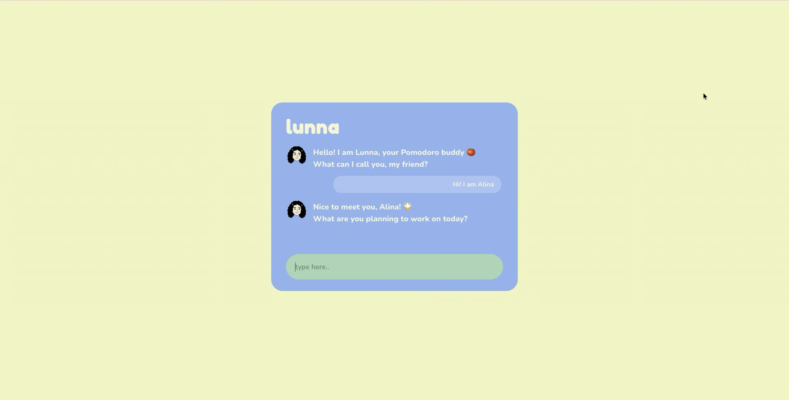
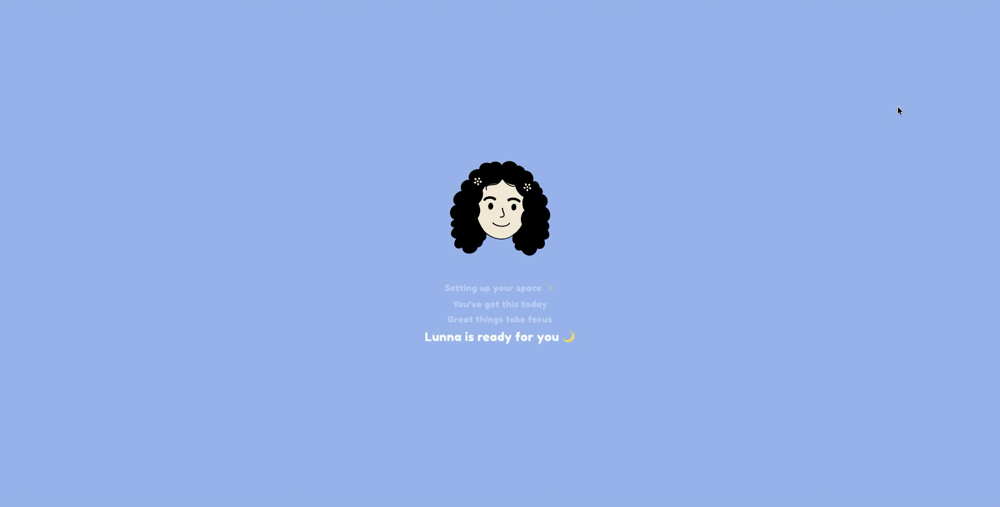
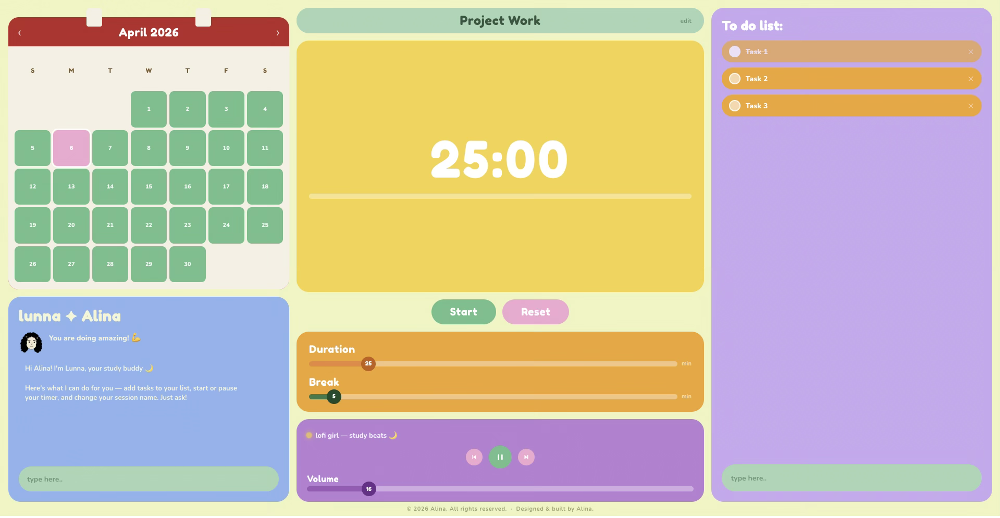

# lunna — AI Pomodoro Study Buddy

Lunna is an AI-powered Pomodoro timer with a built-in study companion. She helps you plan your session, keeps you motivated, and manages your tasks through natural conversation — all in a calm, cute bento-style dashboard.

**Live app:** [lunna-lac.vercel.app](https://lunna-lac.vercel.app)

---

## Screenshots

### Onboarding
> Lunna greets you and helps you set up your study session through a chat.



### Loading
> A personalised loading animation plays while Lunna gets ready.



### Dashboard
> The full bento-grid dashboard with timer, tasks, calendar, and Lunna chat.



---

## Features

### Lunna — AI Study Buddy
- Powered by **Groq** (llama-3.3-70b-versatile)
- Chat with Lunna at any time during your session
- She can **add tasks** to your to-do list, **start or pause the timer**, and **rename your session** — all through conversation
- Rotating motivational quips keep you going between messages

### Pomodoro Timer
- Fully customisable **work duration** (1–60 min) and **break duration** (1–30 min) via sliders
- Visual countdown with a **progress bar**
- Start, pause, reset, take a break, or skip break — all in one click
- Timer card changes colour: **yellow** for work, **blue** for break
- **Alarm sound** plays when a session ends

### Session Setup (Onboarding)
- Lunna chats with you to collect your **name**, **goal for the day**, and **initial tasks**
- Smart name extraction — say "I'm Alina" and she figures it out
- Say "let's go", "done", or "start" whenever you're ready

### To-Do List
- Add, check off, and delete tasks
- Tasks are saved **per date** using localStorage — each day starts fresh
- Confetti celebration when you complete a task

### Calendar
- Mini calendar always visible in the top-left
- Highlights **today** and lets you **select any date** to review that day's tasks

### Music Player
- 5 built-in **lofi YouTube tracks** to study to
- Play/pause, skip, and volume control
- Music plays in an embedded iframe with no distractions

### Session Naming
- Click **edit** on the session name pill to rename your session on the fly

---

## Tech Stack

| Layer | Tech |
|-------|------|
| Framework | React 19 |
| AI | Groq API — llama-3.3-70b-versatile |
| Styling | Plain CSS (no UI library) |
| Fonts | Fredoka One, Nunito (Google Fonts) |
| Deployment | Vercel |

---

## Running Locally

```bash
git clone https://github.com/alinarashid/lunna.git
cd lunna
npm install
```

Create a `.env` file in the root:

```
REACT_APP_GROQ_API_KEY=your_groq_api_key_here
```

Then start the dev server:

```bash
npm start
```

Open [http://localhost:3000](http://localhost:3000).

---

## Environment Variables

| Variable | Description |
|----------|-------------|
| `REACT_APP_GROQ_API_KEY` | Groq API key — get one free at [console.groq.com](https://console.groq.com) |

---

Built by [Alina Rashid](https://github.com/alinarashid)
